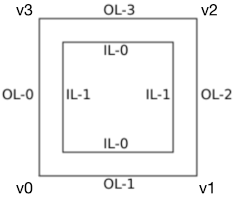

# Tessellation

Tessellation can be treated as subdivision (like the one in Blender) automatically executed by GPU.
In OpenGL, it is achieved by tessellation shaders.

Tessellation can be used to implement the dynamic level of detail (LOD) of a terrain.
Assume that a terrain is composed of several quads,
based on the distance between the viewer and a certain quad,
tessellation shaders decide to either subdivide that quad or not.
The closer the quad is to the viewer, the more subdivisions happen.
For a large terrain, this technique can significantly improve performance.

You can refer to [1, 2] for more details.

# Note

## The shared edge problem

Within a terrain, quads always have shared edges.
For a shared edge of two quads with different resolutions,
if their `gl_TessLevelOuter` parameters are different,
gaps appear between the two quads.
This problem has been reported by [this thread](https://stackoverflow.com/questions/23530807/glsl-tessellated-environment-gaps-between-patches).

## The vertex order of a quad patch

The official document [1] provides the corresponding edges of `gl_TessLevelOuter` and `gl_TessLevelInner` parameters of a quad patch.
But it does not mention the vertex order.
After some tests, I have found the correct order on my computer (`NVIDIA GeForce GT 750M`).

Since the implementation of OpenGL may be different between graphics cards,
the vertex order may also be different.

# Result

# Reference

[1] OpenGL: [Tessellation](https://www.khronos.org/opengl/wiki/Tessellation)

[2] OGL Tutorial 30: [Basic Tessellation](http://ogldev.atspace.co.uk/www/tutorial30/tutorial30.html)
